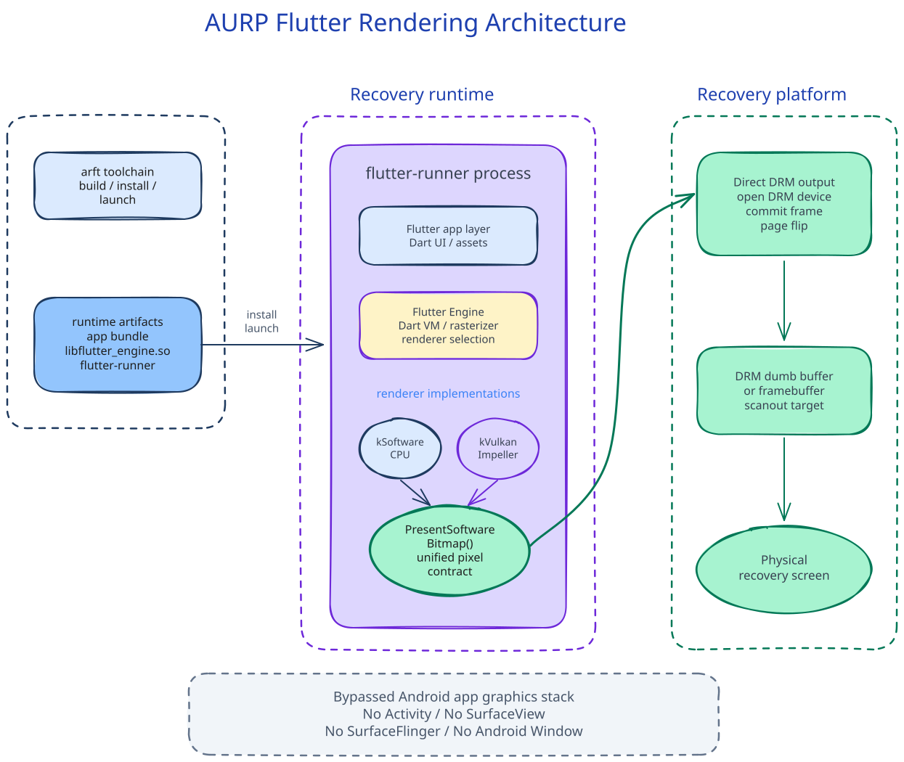

<h1 align="center">Aurora Recovery Project (AURP)</h1>

AURP is built on the TWRP 16 recovery foundation and brings a Flutter-powered interface and runtime into Android Recovery.

  <a href="https://github.com/AuroraRecoveryProject/aurora_recovery">Recovery UI</a>
  ·
  <a href="./README.zh.md">中文</a>

## What This Is

Aurora Recovery Project is an Android recovery project that combines TWRP's low-level recovery capabilities with a modern Flutter application layer.

TWRP remains responsible for the recovery environment itself: boot, partitions, flashing, decryption, ADB, fastbootd, MTP, sideload, device bring-up, and hardware integration. Flutter is used for the user-facing runtime and UI, making it possible to build recovery interfaces with a modern framework and iterate faster than traditional recovery UI development.

The current AURP project is still an early framework. It does not provide the full feature set of the original TWRP GUI. At this stage, it depends on the original TWRP recovery environment and starts the Flutter runtime and AURP interface on top of it. The long-term goal is to gradually replace the original TWRP GUI while keeping the underlying recovery capabilities available.

AURP does not run Flutter as a normal Android app. Android Recovery does not provide SurfaceFlinger or the standard Android application process model. Instead, AURP uses a recovery-oriented embedder path that renders Flutter frames directly into the recovery display backend.

## Rendering Architecture

## What Problems It Solves

- **Reduces TWRP GUI development and iteration cost**: Traditional TWRP GUI development has a complex workflow. UI changes, asset adjustments, and feature validation often require long compile, package, flash, and reboot cycles. AURP brings the Flutter development model into recovery, where hot reload and hot restart can be used to build UI quickly.
- **Brings the mature Flutter ecosystem into recovery**: Flutter state management, internationalization, FFI, and many mature third-party packages from pub.dev can be used in recovery. For example, [xterm.dart](https://github.com/TerminalStudio/xterm.dart) provides more complete terminal sequence handling, improving support for binaries such as vim and nano that depend on a large set of terminal control sequences. FFI plugins such as [flutter_pty](https://github.com/TerminalStudio/flutter_pty) can also be used directly.
- **Preserves low-level native capabilities**: Through FFI and recovery-side native components, AURP can still access partitions, device nodes, command-line tools, and hardware interfaces instead of trapping recovery capabilities inside a pure UI layer. For example, implemented features such as brightness control, settings persistence, and ROM installation reuse and integrate TWRP's existing low-level implementations under the AURP Flutter interface, rather than simply copying the original TWRP GUI.
- **Supports multi-device development and UI adaptation**: By configuring `custom_device.json`, the current framework can support development for multiple devices at the same time and quickly adapt the UI to different devices.
- **Supports CPU or GPU rendering**: CPU rendering does not depend on any system/vendor partition. **GPU rendering depends on the vendor partition and has only been tested on Snapdragon 8 Elite / 骁龙 8 Elite Gen 5 platforms.**

## Project Components

- **[aurora_recovery](https://github.com/AuroraRecoveryProject/aurora_recovery)**  
  The public Flutter recovery GUI application and the main visible entry point of AURP.
- **[TWRP 16](https://github.com/TWRP-Test/android_bootable_recovery)**  
  Provides low-level recovery capabilities such as the recovery boot environment, partitions, flashing, decryption, ADB, MTP, sideload, and fastbootd.
- **Flutter recovery runtime (closed-source)**  
  Runs the Flutter interface in Android Recovery userspace without relying on Android SurfaceFlinger or the normal Android app runtime.
- **Recovery Display Embedder**  
  Presents Flutter frames to the screen through the recovery display path.

## Recovery Tools

AURP also includes small recovery userspace experiments and utility adaptations, such as terminal/runtime tests, networking tools, and command-line helpers.

For example, `cmatrix`, `curl`, `dhcpcd`, and similar components are partially adapted or tested for the constrained Android Recovery environment.

## Source Availability

The AURP GUI project is currently public. Flutter embedding, engine/runtime, toolchain, and some device integration components are currently closed-source or internal components.

## Development Status

AURP is currently an early framework and runtime validation environment, not a full-featured TWRP replacement.

Initial validation has been done around running Flutter inside Android Recovery and calling basic system capabilities. GPU rendering has only been tested on Snapdragon 8 Elite and Snapdragon 8 Elite Gen 5 platforms. Audio support is only available in the closed-source ossi device tree. WLAN depends on device-tree integration, and the integration approach is documented in [TWRP QCOM WIFI Device Tree Integration Plan](https://github.com/AuroraRecoveryProject/aurora_recovery/blob/main/docs/TWRP/TWRP%20QCOM%20WIFI%20%E8%AE%BE%E5%A4%87%E6%A0%91%E9%9B%86%E6%88%90%E6%96%B9%E6%A1%88.md).

Due to extremely limited personal time and the need to maintain several related projects, AURP is entering a low-frequency maintenance state. Large-scale feature development will not be continuously pushed in the short term.

If enough real-world feedback, clear demand, or external participation is collected later, the project will continue feature completion and architecture improvement based on feedback priority.

## Documentation

TWRP Compile Documentation: [TWRP 编译记录](https://github.com/AuroraRecoveryProject/aurora_recovery/blob/23466e5a8f4aa4b8ba7497ab0ba020217f6061e8/docs/TWRP/TWRP%20%E7%BC%96%E8%AF%91%E8%AE%B0%E5%BD%95.md)

Full documentation directory: [docs](https://github.com/AuroraRecoveryProject/aurora_recovery/tree/23466e5a8f4aa4b8ba7497ab0ba020217f6061e8/docs)

### Flutter

- [ARP 触控 Slop 排查记录](https://github.com/AuroraRecoveryProject/aurora_recovery/blob/23466e5a8f4aa4b8ba7497ab0ba020217f6061e8/docs/Flutter/ARP%20%E8%A7%A6%E6%8E%A7%20Slop%20%E6%8E%92%E6%9F%A5%E8%AE%B0%E5%BD%95.md)
- [Flutter Android 字体加载流程](https://github.com/AuroraRecoveryProject/aurora_recovery/blob/23466e5a8f4aa4b8ba7497ab0ba020217f6061e8/docs/Flutter/Flutter%20Android%20%E5%AD%97%E4%BD%93%E5%8A%A0%E8%BD%BD%E6%B5%81%E7%A8%8B.md)
- [刷入 Magisk 中整个 UI 加环境崩溃](https://github.com/AuroraRecoveryProject/aurora_recovery/blob/23466e5a8f4aa4b8ba7497ab0ba020217f6061e8/docs/Flutter/%E5%88%B7%E5%85%A5%20Magisk%20%E4%B8%AD%E6%95%B4%E4%B8%AA%20UI%20%E5%8A%A0%E7%8E%AF%E5%A2%83%E5%B4%A9%E6%BA%83.md)
- [调试底层库崩溃堆栈](https://github.com/AuroraRecoveryProject/aurora_recovery/blob/23466e5a8f4aa4b8ba7497ab0ba020217f6061e8/docs/Flutter/%E8%B0%83%E8%AF%95%E5%BA%95%E5%B1%82%E5%BA%93%E5%B4%A9%E6%BA%83%E5%A0%86%E6%A0%88.md)

### TWRP

- [TWRP OnePlus Pad2Pro 修改记录](https://github.com/AuroraRecoveryProject/aurora_recovery/blob/23466e5a8f4aa4b8ba7497ab0ba020217f6061e8/docs/TWRP/TWRP%20OnePlus%20Pad2Pro%20%E4%BF%AE%E6%94%B9%E8%AE%B0%E5%BD%95.md)
- [TWRP QCOM WIFI 手动启动全流程(OEM)](https://github.com/AuroraRecoveryProject/aurora_recovery/blob/23466e5a8f4aa4b8ba7497ab0ba020217f6061e8/docs/TWRP/TWRP%20QCOM%20WIFI%20%E6%89%8B%E5%8A%A8%E5%90%AF%E5%8A%A8%E5%85%A8%E6%B5%81%E7%A8%8B%28OEM%29.md)
- [TWRP QCOM WIFI 手动启动全流程](https://github.com/AuroraRecoveryProject/aurora_recovery/blob/23466e5a8f4aa4b8ba7497ab0ba020217f6061e8/docs/TWRP/TWRP%20QCOM%20WIFI%20%E6%89%8B%E5%8A%A8%E5%90%AF%E5%8A%A8%E5%85%A8%E6%B5%81%E7%A8%8B.md)
- [TWRP QCOM WIFI 设备树集成方案](https://github.com/AuroraRecoveryProject/aurora_recovery/blob/23466e5a8f4aa4b8ba7497ab0ba020217f6061e8/docs/TWRP/TWRP%20QCOM%20WIFI%20%E8%AE%BE%E5%A4%87%E6%A0%91%E9%9B%86%E6%88%90%E6%96%B9%E6%A1%88.md)
- [TWRP WIFI 对比](https://github.com/AuroraRecoveryProject/aurora_recovery/blob/23466e5a8f4aa4b8ba7497ab0ba020217f6061e8/docs/TWRP/TWRP%20WIFI%20%E5%AF%B9%E6%AF%94.md)
- [TWRP 分支演化分析](https://github.com/AuroraRecoveryProject/aurora_recovery/blob/23466e5a8f4aa4b8ba7497ab0ba020217f6061e8/docs/TWRP/TWRP%20%E5%88%86%E6%94%AF%E6%BC%94%E5%8C%96%E5%88%86%E6%9E%90.md)
- [TWRP 刷写 ROM 分析](https://github.com/AuroraRecoveryProject/aurora_recovery/blob/23466e5a8f4aa4b8ba7497ab0ba020217f6061e8/docs/TWRP/TWRP%20%E5%88%B7%E5%86%99%20ROM%20%E5%88%86%E6%9E%90.md)
- [TWRP 编译记录](https://github.com/AuroraRecoveryProject/aurora_recovery/blob/23466e5a8f4aa4b8ba7497ab0ba020217f6061e8/docs/TWRP/TWRP%20%E7%BC%96%E8%AF%91%E8%AE%B0%E5%BD%95.md)
- [TWRP 配置分析](https://github.com/AuroraRecoveryProject/aurora_recovery/blob/23466e5a8f4aa4b8ba7497ab0ba020217f6061e8/docs/TWRP/TWRP%20%E9%85%8D%E7%BD%AE%E5%88%86%E6%9E%90.md)

Additional build notes, runtime tools, device bring-up records, and implementation documentation are kept in internal repositories that are not currently public.
